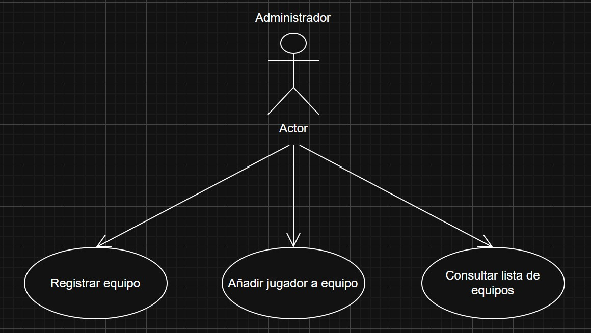
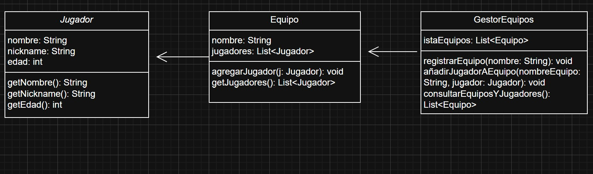

# Sistema de Gestión de Torneos de eSports

## Autor  
**Alberto Sánchez Gutiérrez**  
[https://github.com/ASanchezGutierrez](https://github.com/ASanchezGutierrez)

## Descripción del Proyecto  
[https://github.com/ASanchezGutierrez/torneo-esports-uml](https://github.com/ASanchezGutierrez/torneo-esports-uml)

Este proyecto implementa un sistema de gestión de torneos de eSports utilizando UML para el modelado y Java para la implementación.

## Diagramas UML

### Diagrama de Casos de Uso  
#### Gestión de equipos y jugadores  
- Registrar equipo  
- Añadir jugadores a un equipo  
- Consultar lista de equipos y jugadores  

### Diagrama de Clases  

Clases identificadas:  
- **Jugador** (Entidad)  
- **Equipo** (Entidad)  
- **GestorEquipos** (Control)  
- **VistaPrincipal** (Interfaz)

Relaciones:  
- Un equipo tiene muchos jugadores.  
- El gestor de equipos maneja una lista de equipos y gestiona su lógica.

## Estructura del Proyecto  
La estructura del proyecto está organizada de la siguiente manera:
src/ ├── es/empresa/torneo/ │ ├── modelo/ # Clases de entidad (Jugador, Equipo) │ ├── control/ # Clases de control (GestorEquipos) │ ├── vista/ # Clases de interfaz de usuario (VistaPrincipal) │ ├── Main.java # Punto de entrada del programa └── diagrams/ # Carpeta con los diagramas UML (casos de uso, clases).

- **modelo/**: Contiene las clases que representan las entidades principales del sistema, como `Jugador` y `Equipo`.
- **control/**: Aquí se encuentran las clases encargadas de la lógica de negocio, como `GestorEquipos`.
- **vista/**: Incluye las clases que permiten la interacción con el usuario, en este caso, `VistaPrincipal`.
- **Main.java**: El punto de entrada del programa, donde se ejecuta la lógica principal y se realizan las pruebas del sistema.
- **diagrams/**: Carpeta donde se encuentran los diagramas UML del proyecto, como los diagramas de casos de uso y clases.

### Justificación del Diseño

Se eligió una estructura modular basada en la separación de responsabilidades:

- Las clases **Jugador** y **Equipo** representan entidades del mundo real con sus atributos y métodos específicos.
- La clase **GestorEquipos** centraliza la lógica del sistema, facilitando el mantenimiento.
- La clase **VistaPrincipal** permite interactuar con el sistema de forma ordenada desde consola.
- La relación entre **Equipo** y **Jugador** refleja una composición simple, donde un equipo contiene múltiples jugadores.

Este diseño permite escalar el sistema en el futuro, por ejemplo, añadiendo torneos o partidas sin modificar lo ya existente.

